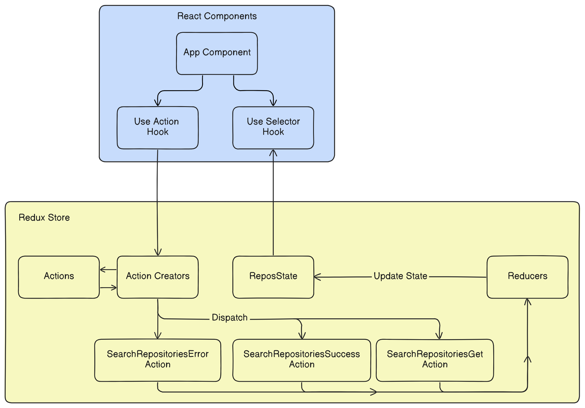

# Getting Started with Create React App

This project was bootstrapped with [Create React App](https://github.com/facebook/create-react-app).


## Overview

This example showcases my approach to building React Redux projects. The project template serves as a blueprint for implementing an efficient development workflow in future projects.

Although the application maintains a minimalist design, its primary objective is to demonstrate the practical implementation of Redux store with TypeScript. Users engage with a simple text input field to search for package names. Upon submission, the application queries the NPM API to retrieve relevant packages, which are then displayed on the screen.

Despite its simplicity, the project exemplifies a scalable approach to integrating Redux and TypeScript in modern frontend applications. The accompanying README provides comprehensive instructions for project setup and dependency installation, laying a solid foundation for building similar projects.



## Installation  

```bash
npm ci
```
## Available Scripts

In the project directory, you can run:

```bash
# Runs the app in the development mode. 
# Open [http://localhost:3000](http://localhost:3000) to view it in your browser.

npm start

# Launches the test runner in the interactive watch mode.\
npm test

# Builds the app for production to the `build` folder.
npm run build
```
